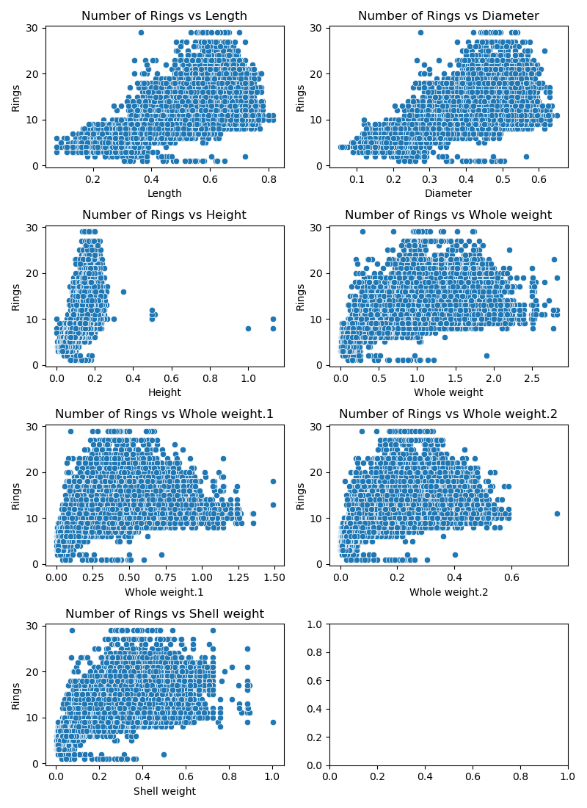
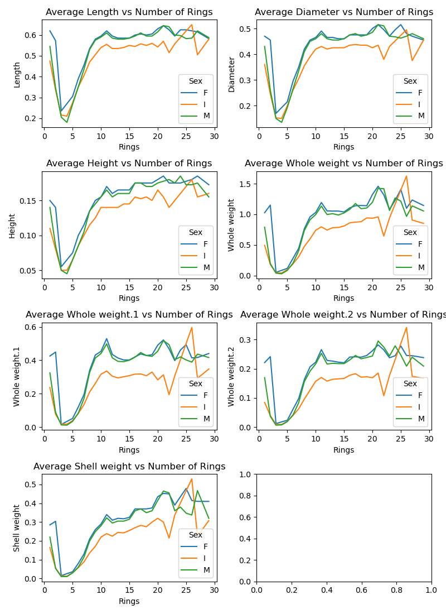
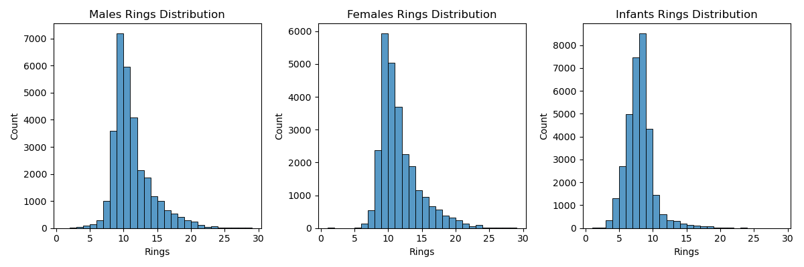
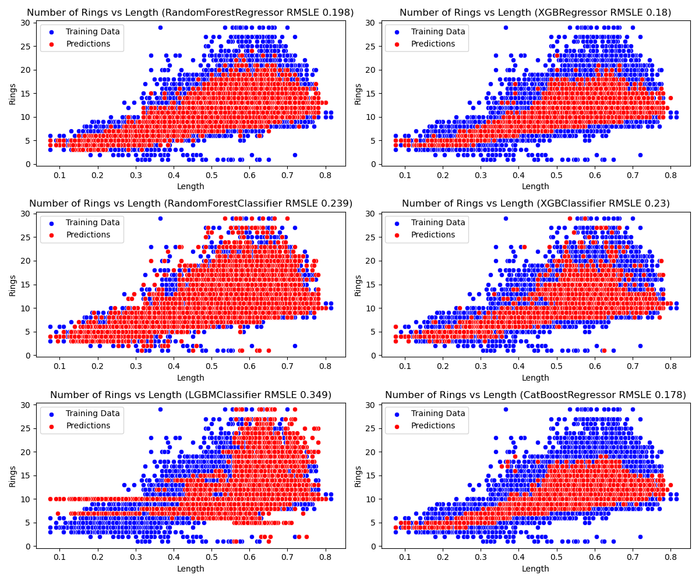
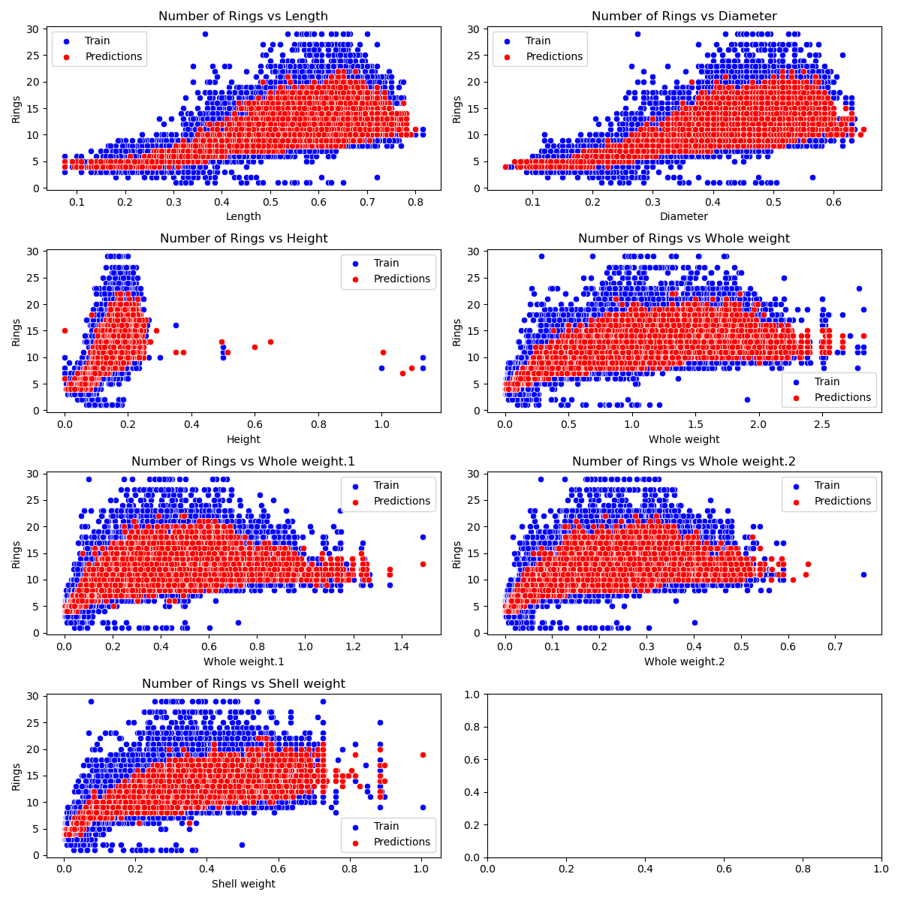

# 
 **Optimising Abalone Price through Age Prediction**
### 

**Overview:** Knowing the age of abalone helps producers optimise feeding regimes and harvesting schedules, leading to maximised meat yield and quality, reduced waste, and minimised production costs, promoting both profitability and sustainability. Currently, the age of abalone is determined through an invasive and time consuming process of slicing and staining the shell, and counting the rings under a microscope. **Here, we demonstrate a lower-cost and less-invasive abalone age prediction technique that requires a simple software and the measurement of size and weight of the abalone, without the need of expensive microscopes or slicing the shell.**

To demonstrate the effectiveness of the technique, we predicted the age of 90,000 abalones (dataset generated from a deep learning model trained on the UCL Abalone dataset) with various machine learning models and achieved a minimum root mean squared error of 0.14650.

In future investigations, the model should be tuned to improve the accuracy and tests should be made on real-world abalones. 

See the "Project Description" section in this file for more information.  

_____________________________________________________________________________________________________________________________________________

**Files and folders in this repository:** 
 - EDA.ipynb: exploratory data analysis of datasets provided
 - EDA-original.ipynb: exploratory data analysis of the original abalone dataset from UCL
 - preprocessing.ipynb: preprocessing, feature engineering, and feature selection performed to make the model selection more efficient
 - model_selection.ipynb: testing of several ML models to see what works best in this challenge
 - final_predictions.ipynb: predictions made with a CatBoostRegressor, which landed 21% of the public leaderboard
 - kaggle-API.ipynb:     download the latest competition data and make submissions using the Kaggle API
 - data: folder where we store all datasets (raw and processed)

**How to Run these Jupyter Notebooks** 
1. The datasets can be downloaded manually on Kaggle ([link here](https://www.kaggle.com/competitions/playground-series-s4e4/data)) or using the Kaggle API (instructions can be found in kaggle-API.ipynb) - modify the pandas import cells at the top of notebooks according to your file path (e.g., in the EDA.ipynb use *pd.read_csv('your_file_path/train.csv')*)
2. Install the necessary modules by running *!pip install module_name* (e.g., *!pip install catboost*)
3. To get a picture of the whole analysis **run the notebooks in the following order i) EDA, ii) preprocessing, iii) model_selection, and iv) final_predictions**

## **Tech Stack Used** 
##### Libraries

 - Pandas: Data manipulation and analysis library
 - NumPy: Fundamental package for scientific computing with Python
 - SciPy: Scientific computing library with statistical functions
 - Matplotlib: Comprehensive visualization library
 - Seaborn: Statistical data visualization library
 - UCI ML Repository (ucimlrepo): Fetch datasets from UCI ML Repository
 - CatBoost: Gradient boosting library for classification and regression
 - scikit-learn: Machine learning library with various algorithms
 - patoolib: Archive extraction library
 - datetime: Module for date and time manipulation

##### APIs
 - Kaggle: API for downlading Kaggle datasets and making submissions

##### Models
 - CatBoostRegressor: Regressor model optimized for categorical features
 - XGBRegressor: Regressor model provided by XGBoost library
 - RandomForestRegressor: Ensemble learning regressor model
 - XGBClassifier: Classifier model provided by XGBoost library
 - RandomForestClassifier: Ensemble learning classifier model
 - LGBMClassifier: Classifier model provided by LightGBM library

 ##### Validation
 - KFold: Cross-validation technique.
 - root_mean_squared_log_error: Metric for evaluating regression models.

 _______________________________

 
# Project Description
### Sections
1. Introduction
2. Methods
* 2.1 Exploratory Data Analysis
* 2.2 Data Preprocessing and Model Selection
* 2.3 Final Model Training and Predictions
3. Results
* 3.1 Data Consistency, Reliability, and Insights
* 3.2 Target-Feature Relationship
* 3.3 Physical Measurements of Different Sexes
* 3.4 CatBoostRegressor is the best model for this task
* 3.5 Final Predictions (top 22% of Kaggle private leaderboard)
4. Conclusions

## 1. Introduction
In the dynamic world of aquaculture abalone molluscs are among the most important and competitive cultures. In 2018/2019, total worldwide production of farmed abalone was estimated at more than 188,000 metric tonnes, reached 243,506 mt in 2020/21 and continues growing. With prices ranging from a few dollars per ounce to upwards of $100 per pound, every detail counts.

Abalone, prized for its unique taste and high market value, sees its prices influenced by factors like species, size, origin, and notably, age. Accurately determining the age of each abalone is crucial. It optimises pricing strategies, improves product quality, and drives economic gains across the value chain. With exact age prediction, the business can categorise its abalone based on size and age, commanding premium prices for larger, older specimens.

By understanding the age distribution of their abalone stock, producers can optimise feeding regimes and harvesting schedules. This leads to maximised meat yield and quality, reduced waste, and minimised production costs, promoting both profitability and sustainability.
Exact age prediction isn't merely a technological advancement, it's a strategic imperative for the abalone industry. By leveraging age data, businesses can unlock new levels of profitability and efficiency while ensuring consumers receive high-quality products. As the aquaculture sector evolves, the quality of age prediction will remain an important competitive differentiator, driving economic growth and sustainability.

In this project, we investigate the effectiveness of various machine learning models in predicting the age of abalone from various physical measurements. The dataset (obtained from [Kaggle](https://www.kaggle.com/competitions/playground-series-s4e4/data)) was generated from a deep learning model trained on the [UCL Abalone dataset](https://archive.ics.uci.edu/dataset/1/abalone).

## 2 Methods
### 2.1 Exploratory Data Analysis 
First, we checked the datasets for consistency and reliability, by analysing the summary statistics (mean, median, std, etc.) and distributions of the features and targets and by checking for missing values and duplicated rows. Then, we investigated the relationship between the features and targets and the difference in physical measurements between sexes.

### 2.2 Data Preprocessing and Model Selection 
To speed up the process of model selection (i.e., to make the dataset lighter), we removed the strongly correlated columns (>0.97 Pearson correlation) - these were Diameter, Whole weight.1, Whole weight.2, and Shell weight. Furthermore, we one-hot encoded the categorical variable "Sex" (this is necessary for use with the Scikit-Learn library) and created a "DimensionsCluster" feature using KMeans clustering, which significantly improved the predictions. Six models (RandomForestRegressor, RandomForestClassifier, XGBRegressor, XGBClassifier, LGBMClassifier, and CatBoostRegressor) were evaluated using cross-validation to minimise the Root Mean Squared Logarithmic Error (RMSLE).

### 2.3 Final Model Training and Predictions
The CatBoostRegressor was selected as the best-performing model due to its lower RMSLE during cross-validation. It was trained on the entire dataset and used to make predictions on the test data. Since by default the CatBoostRegressor uses the RMSE as objective metric but we want to minize the RMSLE, to improve the score further we log-transformed the target for training and predictions and exponentiated the predictions.

## 3 Results
### 3.1 Data Consistency, Reliability, and Insights
No null and duplicates were found and the distribution of features were found to be similar between the train and test set. A strong linear correlation was found between dimension features (length, height, and diameter), as well as between weight features (Whole weight, Whole weight.1, Whole weight.2), giving us scope for feature selection (e.g., keeping only one feature for each category).

### 3.2 Target-Feature Relationship
The image below shows the relationship between the target variable Rings and each of the features, indicating a moderate linear relationship in all cases. This is not surprising since we expect abalones to increase in size and weight with age

### 3.3 Physical Measurements of Different Sexes
As can be seen in the plots below, males and females have very similar physical measurements (in particular, between 4 and 23 rings), while Infants are significantly smaller and lighter.

Similarly, the plots below show that males and females have a very similar distribution of Rings (mean ~ 10), which are quite different from that of Infants (mean ~ 8).  

### 3.4 CatBoostRegressor is the best model for this task
The figure below shows the results of the predictions of all models made with . Here, we plotted the target vs the Length, but the results are similar for the other features.

The plots above show that regressors make predictions quite homogeneously concentrated in the mid-range of rings (5 to 20 rings) which is where most observations in the train set are. Classifiers on the other hand, can predict the full range (between 1 and 29), which might be better in real life. However, for the purpose of minimising the RMSLE the Regressors performed better - particularly the CatBoostRegressor with a RMSE of 0.178 (bottom right plot in the figure above).

### 3.5 Final Predictions (top 22% of Kaggle private leaderboard)

The final predictions were made with a CatBoostRegressor on the full training set (all features included plus the engineered "DimensionsCluster" feature). Based on previous trials, the following hyperparameters were selected: iterations = 5000, depth = 7. The figure below shows plots of Predicted and Training Rings vs all the numerical features.

As expected from the model selection process, the CatBoostRegressor made predictions between 4 and 22 Rings (values should go between 1 and 29).This is a consequence of using the RMSE as the objective function (this is the case in all regression models used in this project). If we were minimising the accuracy or recall (or any classification metrics), then making predictions very far away from the true value would not be penalised more than making them just a bit away from the true value (predictions are either correct or incorrect). For this reason, classifiers might be better for practical purposes, especially because it is important to correctly classify old Abalones (Rings > 23), since they tend to be more valuable. 

Overall, the above predictions resulted in a private Kaggle score (RMSLE) of 0.14650, which landed us 577 out of 2608 participants (22%). 

## 4 Conclusion

We demonstrated that machine learning models can be used to predict the age of abalone accurately (RMSLE < 0.15) by simply measuring the size and weight of the shells, which is significantly faster and less invasive than the current method of slicing and staining the shell, and counting the rings under a microscope. 

We also showed that classification algorithms can better predict the full range of possible rings of abalones and that the CatBoost is the best model for this task. 

In the future, the original abalone dataset should be used for training and the models should be tuned before the model selection stage. More features should be engineered and tested and ensembling or stacking multiple machine learning models should be considered. 

With an optimised model, a simple software could be developed that would allow harvesters to determine the age, and consequently the price, of Abalone right at the harvesting site, or shortly after in the distribution process.